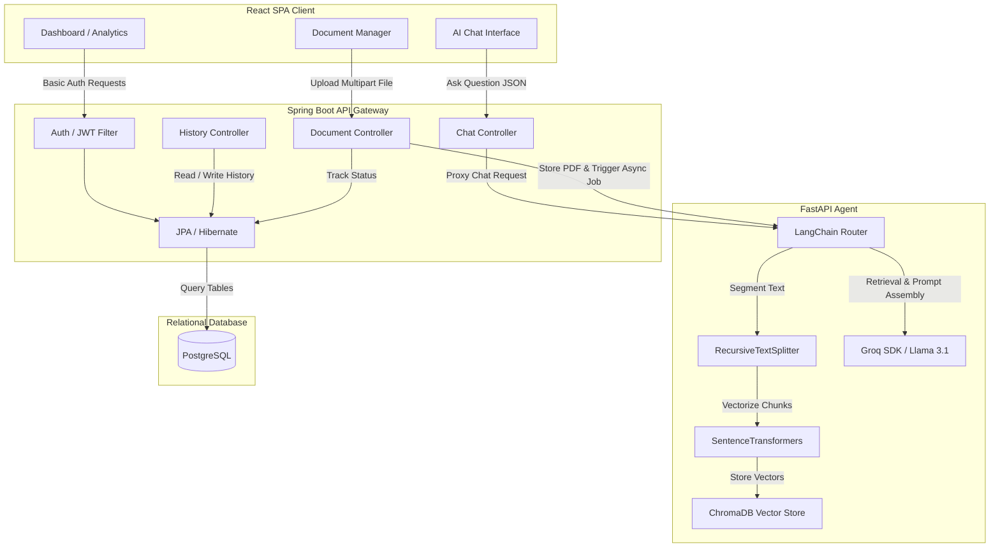

# NetPilot AI: Enterprise Network Documentation Assistant

NetPilot AI is a production-grade, multi-tier AI-powered Documentation Assistant that implements Retrieval-Augmented Generation (RAG) to parse, index, and query enterprise network manuals, switch configurations, routing topologies, and ACL logs using natural language.

---

## 🗺️ System Architecture

The application is structured as a three-tier decoupled architecture:
1. **React Web Frontend**: A responsive, dark-mode compatible client dashboard and chat workspace.
2. **Spring Boot API Gateway**: Manages relational data (users, auth contexts, conversation history), handles file upload validations, and proxies RAG inquiries.
3. **FastAPI AI Agent**: Extract text from PDFs, segments contents, computes vector embeddings, indexes chunks into ChromaDB, and performs context-retrieval for LLM chat completion.



---

## ⚡ Key Features

- **ChatGPT-Style Chat View**: 
  - Dynamic user & bot bubbles, pulsing typing loader, and auto-scroll behaviors.
  - Custom React Markdown component supporting bold styling, code frames, and nested list items.
  - Multi-source reference highlights identifying files and PDF pages used for the context.
- **Enterprise Document Uploader**: 
  - Responsive Drag & Drop overlay or file browser selector.
  - Real-time file upload tracking via Axios progress bars.
  - Status lifecycle polling (`UPLOADED` ➔ `PROCESSING` ➔ `INDEXING` ➔ `READY` ➔ `FAILED`).
  - Storage deletion capabilities and failed upload retry actions.
- **Data Analytics Dashboard**:
  - Interactive Area Charts visualizing weekly question rates and file uploads using Recharts.
  - Interactive Donut Charts graphing document indexing states.
  - Counters tracking total files, storage size, and total questions asked.
- **Robust Security**:
  - Encrypted credential registration and login authentication using Spring Security's HTTP Basic Auth.
- **Fully Configurable**:
  - Complete environment parameter externalization via root `docker-compose.yml`, Spring `application.yml`, and Python `.env`.

---

## 🛠️ Technology Stack

| Tier | Component / Library | Version | Description |
| :--- | :--- | :--- | :--- |
| **Frontend** | React / Vite | `^19.2.7` / `^8.1.1` | Modern, fast compiler web workspace. |
| | Tailwind CSS / shadcn/ui | `^4.3.2` / `^4.13.0` | Sleek layout styling and custom components. |
| | TanStack React Query | `^5.66.0` | Caching and background query polling. |
| | Recharts | `^2.15.1` | Responsive SVG graphing components. |
| **Backend** | Spring Boot | `3.5.16` | Java 21 web starter and REST router. |
| | Spring Security | 3.x | HTTP Basic authentication and password encoding. |
| | PostgreSQL | 15 | Relational storage for users and Q&A history logs. |
| **AI Agent** | FastAPI / Uvicorn | `^0.100.0` | High performance Python web host. |
| | LangChain / ChromaDB | `^0.1.0` | Document loader, chunking, and vector db. |
| | SentenceTransformers | `^2.2.0` | Local `all-MiniLM-L6-v2` embedding runner. |
| | Groq SDK | `^0.4.0` | High-speed Llama 3.1 LLM completion client. |

---

## 📁 Directory Structure

```text
├── ai-service/                 # Python FastAPI AI Agent
│   ├── app/                    # Application source code
│   │   ├── api/                # FastAPI routers (chat, documents, health)
│   │   ├── core/               # Configuration settings class (Pydantic)
│   │   └── services/           # Services (LLM, Embeddings, PDF, VectorStore)
│   ├── Dockerfile              # Multi-stage Python build recipe
│   ├── requirements.txt        # Python pip dependencies list
│   └── .env                    # External configuration variables file
│
├── backend-spring/             # Java Spring Boot API Gateway
│   ├── src/main/java/          # Java source directories
│   │   └── com/netpilot/...    # Controllers, Entities, DTOs, Security filters
│   ├── src/main/resources/     # Resource files
│   │   └── application.yml     # Application properties config
│   ├── Dockerfile              # Multi-stage Maven compiler & JRE runner
│   └── pom.xml                 # Maven build dependencies description
│
├── frontend/                   # React Single-Page Application
│   ├── src/                    # React frontend source
│   │   ├── components/         # Reusable layouts, navbars, and shadcn UIs
│   │   ├── context/            # AuthContext provider
│   │   ├── pages/              # Workspace views (Dashboard, Chat, Documents)
│   │   └── services/           # Axios HTTP Client (api.js)
│   ├── Dockerfile              # Node.js builder & Nginx host recipe
│   ├── nginx.conf              # SPA route redirect properties
│   └── package.json            # NPM dependencies script
│
└── docker-compose.yml          # Global Docker multi-container orchestrator
```

---

## 🚀 Installation & Local Running

### Prerequisites
- Node.js (v18+)
- Java JDK 21
- Maven (3.8+)
- Python (3.10+)

---

### Option A: Standard Manual Running

#### 1. Start Database (PostgreSQL)
Ensure you have a PostgreSQL server active. Paste your JDBC URL into Spring's configuration.

#### 2. Start FastAPI AI Agent
1. Navigate to `./ai-service`.
2. Create a `.env` file containing:
   ```env
   GROQ_API_KEY=your_groq_api_key
   MODEL_NAME=llama-3.1-8b-instant
   ```
3. Run the following:
   ```bash
   python -m venv venv
   source venv/Scripts/activate # On Windows: .\venv\Scripts\activate
   pip install -r requirements.txt
   uvicorn app.main:app --host 0.0.0.0 --port 8000
   ```

#### 3. Start Spring Boot Backend
1. Navigate to `./backend-spring`.
2. Compile and run:
   ```bash
   ./mvnw spring-boot:run
   ```

#### 4. Start React Frontend
1. Navigate to `./frontend`.
2. Run:
   ```bash
   npm install
   npm run dev
   ```
3. Access `http://localhost:5173` in your browser.

---

### Option B: Running with Docker Compose
To build and run all services (including a local PostgreSQL instance) inside isolated containers:
```bash
docker compose up --build
```
Once healthy, access the React frontend at `http://localhost`.

---

## 🔌 API Endpoint Catalog

### Auth Services
- `POST /api/auth/register` - Creates a new user profile.
- `POST /api/auth/login` - Validates credentials.

### Document Indexing
- `POST /api/documents/upload` - Uploads a PDF documentation file.
- `GET /api/documents/{documentId}/status` - Retrieves vectorization process status.

### Chat & Q&A
- `POST /api/chat/ask` - Submits inquiries using the RAG index.

### History Logs
- `GET /api/history` - Fetches the user's historical Q&A list.
- `DELETE /api/history` - Clears the user's history list.

---

## 🔮 Future Roadmap

- **Cross-document querying**: Support answering questions across multiple selected manuals.
- **WebSockets streaming**: Stream LLM answers token-by-token for faster UI responses.
- **RBAC Roles**: Introduce Admin options to approve or revoke document upload privileges.
- **Third-Party Integrations**: Support sync tasks from GitHub or Cisco documentation links.

---

## 📄 License

This project is licensed under the MIT License.